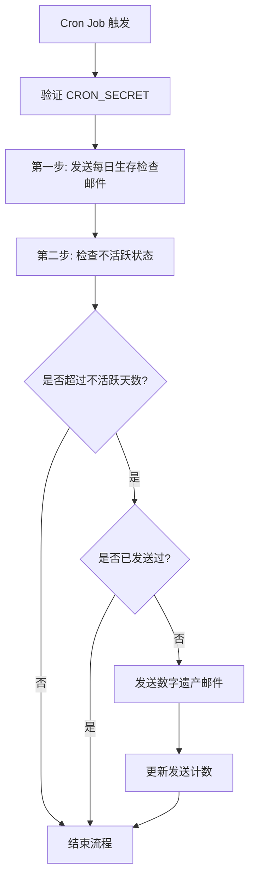

# 邮件发送逻辑说明

## 概述

数字遗产系统通过 `/api/combined-daily-check` 端点实现两种邮件的发送：
1. **每日生存检查邮件** - 发送给用户本人
2. **数字遗产邮件** - 发送给指定的亲朋好友

## 核心流程

### 触发方式
- **定时触发**: 每天 UTC 时间 5:00（北京时间 13:00）通过 Vercel Cron Job 自动触发 或者使用 github actions 定时触发
- **手动触发**: 通过 POST 请求调用 `/api/combined-daily-check` 端点

### 执行顺序


## 一、每日生存检查邮件

### 1.1 发送条件判断

**函数**: `shouldSendKeepAliveEmail(inactivityDays: string)`

**判断逻辑**:
```typescript
// 获取最后活动时间戳
const lastActiveTimestamp = await kvStore.get('last_active_timestamp');

// 计算距离上次活动的天数
const daysSinceLastActive = (Date.now() - lastActiveTimestamp) / (1000 * 60 * 60 * 24);

// 计算剩余时间（毫秒）
const timeRemaining = (inactivityDays * 24 * 60 * 60 * 1000) - (Date.now() - lastActiveTimestamp);

if (timeRemaining <= 0) {
  // 已超过不活跃时限，不发送生存检查邮件
  return { shouldSend: false, reason: '已超过不活跃时限' };
}

// 还在不活跃时限内，应该发送
return { shouldSend: true, timeRemaining };
```

**关键点**:
- 只有在**不活跃时限内**才发送生存检查邮件
- 一旦超过不活跃天数，停止发送生存检查邮件
- 返回剩余时间用于邮件中显示倒计时

### 1.2 邮件内容

**收件人**: 用户本人（`USER_EMAIL`）

**主题**: 从环境变量 `KEEPALIVE_EMAIL_SUBJECT` 读取
- 默认: "每日生存检查 - 请点击确认"

**邮件结构**:
```html
<!DOCTYPE html>
<html>
<head>
  <title>每日生存检查</title>
  <style>
    /* 响应式样式 */
  </style>
</head>
<body>
  <div class="container">
    <div class="header">
      <div class="emoji">🌟</div>
      <h1>每日生存检查</h1>
    </div>
    
    <div class="content">
      <p>您好！这是一封每日生存检查邮件。</p>
      
      <!-- 倒计时提醒 -->
      <div class="warning-box">
        <p>⏰ 距离数字遗产邮件发送还有：</p>
        <p class="time-remaining">[X天X小时X分钟]</p>
      </div>
      
      <p>为了确保您的数字遗产系统正常运行，请点击下面的按钮进行每日签到：</p>
      
      <!-- 签到按钮 -->
      <p style="text-align: center;">
        <a href="[签到链接]" class="button">点击签到</a>
      </p>
      
      <p>签到后，系统将记录您的活动时间，推迟数字遗产邮件的发送。</p>
      
      <p><strong>请注意：</strong>如果您超过设定的不活跃天数未签到，
         系统将自动向您的指定联系人发送包含重要信息的邮件。</p>
    </div>
    
    <div class="footer">
      <p>这封邮件由数字遗产系统自动发送<br>
         如有问题，请检查您的配置</p>
    </div>
  </div>
</body>
</html>
```

**关键元素**:
1. **倒计时显示**: 通过 `getTimeHighlightHtml()` 函数生成，显示剩余时间
2. **签到链接**: `https://your-domain.com/check-in?secret=[KEEPALIVE_SECRET]`
3. **响应式设计**: 支持移动端和桌面端显示

### 1.3 发送实现

```typescript
// 使用 Resend 服务发送邮件
const resend = new Resend(process.env.RESEND_API_KEY);

const { data, error } = await resend.emails.send({
  from: process.env.SENDER_EMAIL,      // 发件人邮箱
  to: [process.env.USER_EMAIL],        // 收件人（用户本人）
  subject: emailSubject,                // 邮件主题
  html: emailHtml,                      // HTML 内容
});

if (error) {
  console.error('发送生存检查邮件失败:', error);
  // 记录错误但不中断流程
}
```

## 二、数字遗产邮件

### 2.1 发送条件判断

**函数**: `shouldSendFinalEmail(inactivityDays: string)`

**判断逻辑**:
```typescript
// 获取最后活动时间戳
const lastActiveTimestamp = await kvStore.get('last_active_timestamp');

// 计算超出不活跃时限的天数
const excessDays = daysSinceLastActive - inactivityDays;

if (excessDays <= 0) {
  // 还在不活跃时限内，不发送
  return { shouldSend: false, reason: '还在不活跃时限内' };
}

// 获取已发送次数
const finalEmailCount = await kvStore.get('final_email_sent_count') || 0;

if (finalEmailCount > 0) {
  // 已经发送过，不再发送
  return { shouldSend: false, reason: '已发送过最终邮件' };
}

// 满足条件，应该发送
return { shouldSend: true };
```

**关键点**:
- 必须**超过不活跃天数**才发送
- **只发送一次**，通过 `final_email_sent_count` 计数器控制
- 发送后立即更新计数器和活动时间戳，防止重复发送

### 2.2 邮件内容

**收件人**: 指定的亲朋好友（`RECIPIENT_EMAILS`）
- 支持多个收件人，用逗号分隔
- 例如: "friend1@example.com, friend2@example.com"

**主题**: 从环境变量 `EMAIL_SUBJECT` 读取
- 默认: "重要信息 - 来自您亲朋的数字遗产"

**邮件结构**:
```html
<!DOCTYPE html>
<html>
<head>
  <title>重要通知</title>
  <style>
    /* 专业的样式设计 */
  </style>
</head>
<body>
  <div class="container">
    <div class="header">
      <div class="emoji">💌</div>
      <h1>重要通知</h1>
      <p>数字遗产系统自动发送</p>
    </div>
    
    <div class="content">
      <!-- 第一部分：告别信 -->
      <div class="section">
        <h2>📝 来自亲友的留言</h2>
        <div class="letter-content">
          [FAREWELL_LETTER_HTML 内容]
        </div>
      </div>
      
      <!-- 第二部分：重要信息 -->
      <div class="section">
        <h2>🔐 重要信息</h2>
        <div class="info-content">
          [IMPORTANT_INFO_HTML 内容]
        </div>
      </div>
      
      <!-- 第三部分：系统说明 -->
      <div class="notice">
        <p><strong>关于这封邮件：</strong></p>
        <p>这封邮件是通过数字遗产系统自动发送的。
           发送者在 [X] 天前设置了这个系统，
           并在超过 [Y] 天未活动后触发了这封邮件。</p>
      </div>
    </div>
    
    <div class="footer">
      <p>此邮件由数字遗产系统自动发送<br>
         如果这是错误通知，请联系系统管理员</p>
    </div>
  </div>
</body>
</html>
```

**内容来源**:
1. **告别信**: `FAREWELL_LETTER_HTML` 环境变量
   - 用户自定义的告别内容
   - 支持完整的 HTML 格式

2. **重要信息**: `IMPORTANT_INFO_HTML` 环境变量
   - 账户信息、密码、重要文件位置等
   - 支持完整的 HTML 格式

### 2.3 发送实现

```typescript
// 解析收件人列表
const recipients = process.env.RECIPIENT_EMAILS
  .split(',')
  .map(email => email.trim());

// 组合完整的邮件内容
const fullEmailHtml = `
  <!DOCTYPE html>
  <html>
    <!-- 邮件头部 -->
    <body>
      <!-- 告别信部分 -->
      ${process.env.FAREWELL_LETTER_HTML}
      
      <!-- 重要信息部分 -->
      ${process.env.IMPORTANT_INFO_HTML}
      
      <!-- 系统说明 -->
    </body>
  </html>
`;

// 发送邮件
const { data, error } = await resend.emails.send({
  from: process.env.SENDER_EMAIL,
  to: recipients,                    // 多个收件人
  subject: process.env.EMAIL_SUBJECT,
  html: fullEmailHtml,
});

if (!error) {
  // 发送成功后更新状态
  const currentCount = await kvStore.get('final_email_sent_count') || 0;
  await kvStore.set('final_email_sent_count', currentCount + 1);
  
  // 更新活动时间戳，防止重复发送
  await kvStore.set('last_active_timestamp', Date.now());
}
```

## 三、状态管理

### 3.1 KV 存储键值

系统使用 Vercel KV 存储以下状态：

| 键名 | 类型 | 说明 |
|------|------|------|
| `last_active_timestamp` | number | 最后活动时间戳（毫秒） |
| `final_email_sent_count` | number | 数字遗产邮件发送次数 |

### 3.2 状态更新时机

**更新 `last_active_timestamp`**:
1. 用户点击签到链接访问 `/check-in` 页面时
2. 用户调用 `/api/keep-alive` 端点时
3. 发送数字遗产邮件后（防止重复发送）

**更新 `final_email_sent_count`**:
- 仅在成功发送数字遗产邮件后 +1

## 四、环境变量配置

### 4.1 必需配置

```env
# Resend 邮件服务
RESEND_API_KEY=re_xxxxx

# 发件人和收件人
SENDER_EMAIL=noreply@yourdomain.com
USER_EMAIL=your@email.com

# 签到密钥
KEEPALIVE_SECRET=your_secret_key

# Cron Job 密钥
CRON_SECRET=your_cron_secret
```

### 4.2 数字遗产邮件配置（可选）

```env
# 收件人列表（多个用逗号分隔）
RECIPIENT_EMAILS=friend1@example.com,friend2@example.com

# 不活跃天数阈值
INACTIVITY_DAYS=7

# 邮件主题
EMAIL_SUBJECT=重要信息 - 来自您亲朋的数字遗产
KEEPALIVE_EMAIL_SUBJECT=每日生存检查 - 请点击确认

# 邮件内容（HTML 格式）
FAREWELL_LETTER_HTML=<p>亲爱的朋友们，如果你们收到这封邮件...</p>
IMPORTANT_INFO_HTML=<p><strong>社交媒体账户：</strong>...</p>
```

**注意**:
- 如果不配置 `RECIPIENT_EMAILS`、`EMAIL_SUBJECT`、`FAREWELL_LETTER_HTML`、`IMPORTANT_INFO_HTML` 和 `INACTIVITY_DAYS`，系统将**只发送生存检查邮件**，不会发送数字遗产邮件
- 这种设计允许用户灵活选择是否启用数字遗产功能

## 五、签到流程

### 5.1 签到链接格式

```
https://your-domain.com/check-in?secret=[KEEPALIVE_SECRET]
```

### 5.2 签到处理

当用户点击签到链接时：

1. **验证密钥**: 检查 URL 参数中的 `secret` 是否匹配 `KEEPALIVE_SECRET`
2. **调用 API**: 前端调用 `/api/keep-alive?secret=[KEEPALIVE_SECRET]`
3. **更新时间戳**: API 更新 `last_active_timestamp` 为当前时间
4. **显示结果**: 页面显示签到成功或失败信息

### 5.3 签到效果

```typescript
// 签到成功后
await kvStore.set('last_active_timestamp', Date.now());

// 重置不活跃计时器
// 下次检查时会重新计算距离上次活动的天数
```

## 六、时间计算逻辑

### 6.1 剩余时间计算

```typescript
function formatTimeRemaining(milliseconds: number): string {
  const days = Math.floor(milliseconds / (1000 * 60 * 60 * 24));
  const hours = Math.floor((milliseconds % (1000 * 60 * 60 * 24)) / (1000 * 60 * 60));
  const minutes = Math.floor((milliseconds % (1000 * 60 * 60)) / (1000 * 60));
  
  return `${days}天 ${hours}小时 ${minutes}分钟`;
}
```

### 6.2 不活跃天数计算

```typescript
const lastActiveTimestamp = await kvStore.get('last_active_timestamp');
const daysSinceLastActive = (Date.now() - lastActiveTimestamp) / (1000 * 60 * 60 * 24);
```

### 6.3 超出天数计算

```typescript
const excessDays = daysSinceLastActive - inactivityDays;
// excessDays > 0 表示已超过不活跃时限
// excessDays <= 0 表示还在不活跃时限内
```

## 七、错误处理

### 7.1 邮件发送失败

```typescript
if (error) {
  console.error('发送邮件失败:', error);
  // 记录错误但不中断流程
  // 下次 Cron Job 触发时会重试
}
```

### 7.2 环境变量缺失

```typescript
if (!process.env.RESEND_API_KEY) {
  return NextResponse.json(
    { error: '缺少必需的环境变量' },
    { status: 500 }
  );
}
```

### 7.3 认证失败

```typescript
const authHeader = request.headers.get('authorization');
if (!authHeader || authHeader !== `Bearer ${process.env.CRON_SECRET}`) {
  return NextResponse.json(
    { error: '未授权' },
    { status: 401 }
  );
}
```

## 八、响应格式

### 8.1 成功响应

```json
{
  "success": true,
  "keepAliveEmail": {
    "sent": true,
    "emailId": "abc123",
    "to": "user@example.com",
    "subject": "每日生存检查",
    "timeRemaining": 518400000
  },
  "finalEmail": {
    "sent": true,
    "emailId": "def456",
    "to": ["friend1@example.com", "friend2@example.com"],
    "subject": "重要信息 - 来自您亲朋的数字遗产"
  }
}
```

### 8.2 部分成功响应

```json
{
  "success": true,
  "keepAliveEmail": {
    "sent": true,
    "emailId": "abc123",
    "to": "user@example.com",
    "subject": "每日生存检查"
  },
  "finalEmail": {
    "sent": false,
    "reason": "还在不活跃时限内"
  }
}
```

## 九、测试建议

### 9.1 本地测试

```bash
# 测试合并端点
curl -X POST "http://localhost:3000/api/combined-daily-check" \
  -H "Authorization: Bearer your_cron_secret"
```

### 9.2 生产环境测试

```bash
# 使用实际的 CRON_SECRET
curl -X POST "https://your-app.vercel.app/api/combined-daily-check" \
  -H "Authorization: Bearer $CRON_SECRET"
```

### 9.3 测试场景

1. **正常流程**: 设置较短的不活跃天数（如 1 天），测试完整流程
2. **签到功能**: 点击邮件中的签到链接，验证时间戳更新
3. **重复发送**: 验证数字遗产邮件只发送一次
4. **环境变量**: 测试缺少可选配置时的行为

## 十、最佳实践

### 10.1 安全建议

1. **保护密钥**: 确保 `KEEPALIVE_SECRET` 和 `CRON_SECRET` 足够复杂
2. **HTTPS**: 始终使用 HTTPS 传输敏感信息
3. **环境隔离**: 生产环境和测试环境使用不同的密钥

### 10.2 内容建议

1. **告别信**: 保持真诚、简洁，避免过于情绪化
2. **重要信息**: 清晰列出账户、密码、文件位置等
3. **定期更新**: 定期检查和更新重要信息的准确性

### 10.3 监控建议

1. **日志记录**: 记录每次邮件发送的结果
2. **告警设置**: 邮件发送失败时发送告警
3. **定期检查**: 定期验证系统是否正常运行

## 十一、常见问题

### Q1: 为什么收不到每日生存检查邮件？

**可能原因**:
1. 已超过不活跃天数（系统停止发送生存检查邮件）
2. 邮件服务配置错误（检查 `RESEND_API_KEY` 和 `SENDER_EMAIL`）
3. Cron Job 未正确配置或触发失败

### Q2: 数字遗产邮件会发送多次吗？

**答**: 不会。系统通过 `final_email_sent_count` 计数器确保只发送一次。

### Q3: 如何重置系统状态？

**答**: 可以通过以下方式重置：
1. 点击签到链接更新活动时间
2. 手动调用 `/api/keep-alive` 端点
3. 直接修改 KV 存储中的值（需要管理员权限）

### Q4: 可以只使用生存检查功能，不启用数字遗产功能吗？

**答**: 可以。只需不配置 `RECIPIENT_EMAILS`、`EMAIL_SUBJECT`、`FAREWELL_LETTER_HTML`、`IMPORTANT_INFO_HTML` 和 `INACTIVITY_DAYS` 这些环境变量即可。

## 十二、技术栈

- **框架**: Next.js 14 (App Router)
- **邮件服务**: Resend
- **存储**: Vercel KV (Redis)
- **部署**: Vercel
- **定时任务**: Vercel Cron Jobs
- **语言**: TypeScript

## 十三、相关文件

- **主端点**: `app/api/combined-daily-check/route.ts`
- **签到页面**: `app/check-in/page.tsx`
- **保活端点**: `app/api/keep-alive/route.ts`
- **存储工具**: `lib/kv-storage.ts`
- **定时任务配置**: `vercel.json`

---

**文档版本**: 1.0  
**最后更新**: 2025-11-24  
**维护者**: 数字遗产系统开发团队